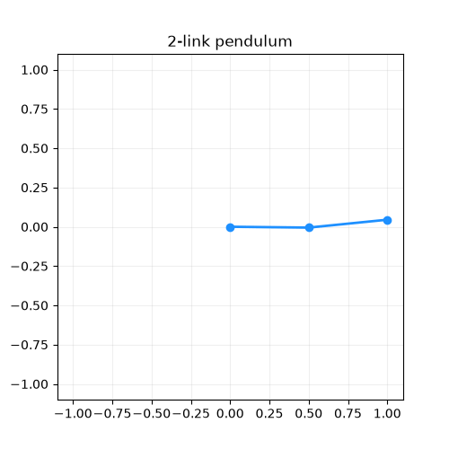

# Pendulum × RuVector — a calibration & GNN-memory testbed

A multi-link pendulum simulator built to experiment with
**[RuVector](https://github.com/ruvnet/RuVector)** (a Rust vector database + GNN
memory) for **robotic-arm calibration** and agentic workflows. It gives you a
fully-observable, chaotic physical system whose *true* parameters you control,
*imperfect* sensors you configure, and data shaped to drop straight into a
vector index and a graph neural network.

It ships the **same simulator twice** — once in Python (fast to hack on, rich
logging) and once in Rust (talks to RuVector in-process) — so you can pick the
ergonomics you want without changing the physics.

|  |  |
|---|---|
|  |  |
| Python sim (`multi_link_pendulum`) | Rust sim (`pendulum_rs`) |

---

## ⭐ Flagship demo: an underactuated arm that balances itself (`pendulum_rs`)

Beyond data logging, the Rust crate runs a **Pendubot** — a 2-link arm where
**only joint 0 has a motor**. It must hold the whole arm straight up (an unstable
equilibrium) through that single joint, using an LQR computed in-Rust.

Two arms run side by side: a **naive** one with a fixed gain and an **adaptive**
one that recomputes its gain when the arm changes. When link 2 suddenly extends,
the naive arm topples while the adaptive arm recalibrates and stays up — the
visual case for fast, RuVector-driven calibration.

```bash
cd pendulum_rs
cargo run --release --bin arm -- --newlen 2.0 --out arm.rrd && rerun arm.rrd
```

### 🎮 Play it: You vs RuVector

```bash
cargo run --release --features game --bin play
```

Drive one arm yourself with **A / D** and try to out-balance the self-correcting
arm. Throw disturbances at the RuVector arm — **← / →** poke, **W** wind, **M**
payload — and watch what it can and can't recover from. Balancing an
underactuated double pendulum by hand is brutal; that's the point.

---

## Why a pendulum, for a vector DB?

Calibration is recovering a robot's true physical parameters (link lengths,
masses, joint friction, encoder offsets) from **noisy** measurements. A pendulum
is the ideal miniature of that problem:

- **It's a graph.** Links are nodes, joints are edges — exactly what a GNN
  message-passes over. Train on 2 links, run on 4; the operator is shared.
- **It's chaotic.** Tiny parameter errors diverge fast, so the data carries a
  strong, learnable signal about the true parameters.
- **Ground truth is yours.** Because the dynamics are hand-derived (not a
  black-box engine), every parameter is a plain number you can corrupt, log,
  and try to recover.

RuVector then plays two roles: its **vector DB** retrieves past states that look
like the current (noisy) one to warm-start an estimate, and its **GNN memory**
learns per-joint corrections over the link graph.

---

## What's in here

```
pendulum/
├── multi_link_pendulum/   # Python testbed  — sim, sensor noise, JSONL logging, calibration
├── pendulum_rs/           # Rust crate      — sim + Rerun viz + in-process RuVector (DB + GNN)
└── RuVector/              # git submodule    — the RuVector source, pinned to a commit
```

Each subproject has its own README with full details:

- **[`multi_link_pendulum/`](multi_link_pendulum/README.md)** — the Python
  project. Configurable n-link sim, Gaussian/bias/dropout sensor noise,
  Rerun visualization, and a JSONL logger that emits a flat embedding vector +
  a GNN graph per timestep. Includes a working calibration example that
  recovers link length / friction from noisy data.
- **[`pendulum_rs/`](pendulum_rs/README.md)** — the Rust crate. Same physics,
  but it calls RuVector **in the same process**: each step's state vector is
  inserted into RuVector's HNSW index, the link graph is run through a real
  `ruvector-gnn` layer, and a noisy query retrieves the nearest indexed state
  (the retrieval half of a calibration loop). Visualized live with the Rerun
  Rust SDK.

### Two paths to RuVector

| | Python (`multi_link_pendulum`) | Rust (`pendulum_rs`) |
|---|---|---|
| RuVector coupling | **decoupled** via JSONL files | **in-process** via `path` deps |
| Ingestion | write `.jsonl`, then `ruvector insert` / REST `:6333` | `VectorDB::insert(...)` directly |
| GNN | export graph, feed externally | `RuvectorLayer::forward(...)` inline |
| Best for | quick experiments, data generation | the tight calibration loop, lowest latency |

---

## Quickstart

Clone **with the submodule** (RuVector is referenced, not vendored):

```bash
git clone --recurse-submodules <this repo url>
cd pendulum
# already cloned without it?  git submodule update --init
```

### Python (uses `uv`)

```bash
cd multi_link_pendulum
uv venv && uv pip install -e .
python -m examples.run_visual_demo --links 3 --noise 0.05      # live Rerun viewer
python -m examples.collect_calibration_data --episodes 5        # write data/calibration.jsonl
python -m examples.simple_calibration_experiment --target length
```

### Rust

Needs the Rerun viewer on PATH for live mode (`pip install rerun-sdk==0.33.0` or
`uv tool install rerun-sdk`). Otherwise it writes an `.rrd` you open later.

```bash
cd pendulum_rs
cargo run --release -- --links 3 --spawn                        # sim + live viewer
cargo run --release --features ruvector -- --links 3 --mode actuated
#   ^ inserts state vectors into RuVector, runs the GNN, and retrieves
#     nearest prior states from noisy queries — all in one Rust process.
```

---

## The data contract (what flows into RuVector)

Every timestep produces two complementary shapes (see the Python
[`data_logger.py`](multi_link_pendulum/pendulum_sim/data_logger.py)):

- **Embedding vector** `[ sinθ | cosθ | ω | τ ]` (+ metadata) → the vector index.
  The sin/cos angle encoding makes Euclidean/cosine distance respect angle
  wrap-around.
- **Graph** — per-link node features `[mass, length, θ, ω, τ, sinθ, cosθ, tip_x,
  tip_y]` and a PyTorch-Geometric-style `edge_index` over the joints → the GNN.

Plus the **residual** `observed − true`, which is the supervision signal a
learned calibrator predicts.

---

## Roadmap

| Phase | What | Status |
|---|---|---|
| **1** | Underactuated arm, in-Rust LQR, adaptive-vs-naive balance, interactive game | ✅ done |
| **2** | RuVector *is* the estimator — recall nearest past dynamics to recalibrate fast (replaces the Phase-1 oracle) | ✅ done |
| **3** | Energy swing-up (recover from any fall) + GNN generalization across arm configs | planned |

In Phase 1 the adaptive arm is told the new parameters by an oracle. **Phase 2
swaps that for RuVector** (`cargo run --features vectordb --bin estimate`): the
controller runs a short dithered probe, forms a *dynamics signature* from the
arm's measured motion, queries the vector DB for the nearest seeded arm, and
reuses its known-good gain — calibration as an O(1) memory recall. The naive arm
keeps its stale gain and topples; the adaptive arm recovers after an honest
recognition lag, and a self-learning loop (insert each catch) shrinks that lag
~60% on a repeat. It recognizes structural (link-length) changes within an
operating envelope; broader generalization across the config space is Phase 3.
Phase 3 adds swing-up so the arm recovers from a full knockdown, and uses the
GNN to interpolate to arm configurations never seen before. See
[`pendulum_rs/README.md`](pendulum_rs/README.md) for the control details.

## Status

All three pieces are working and verified end-to-end: the Python calibration
example recovers link length to ~0.1% from noisy data, and the Rust crate
compiles against RuVector's `ruvector-core` + `ruvector-gnn`, inserting state
vectors into a live HNSW store and message-passing the link graph in-process.

This is a research/prototyping testbed — clarity and extensibility over
optimization.

## License

[MIT](LICENSE). RuVector is a separate project under its own license (see the
`RuVector/` submodule).
