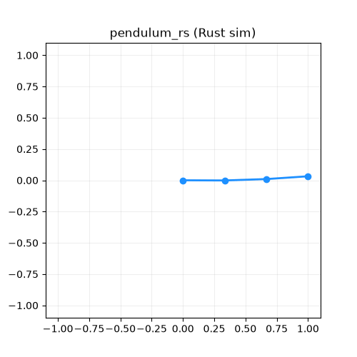

# pendulum_rs



*A triple pendulum simulated by this crate. The same run inserted 108 state
vectors into a RuVector HNSW store and ran GNN message-passing over the link
graph — all in one Rust process.*

A **Rust-native** n-link pendulum: hand-derived Lagrangian dynamics → live
**Rerun** visualization, with an optional **in-process RuVector** loop
(vector-DB insert + GNN message passing). This is the Rust sibling of the Python
`multi_link_pendulum/` project — same physics, but everything stays in the Rust
ecosystem alongside RuVector, so there's **no JSONL bridge**: the simulator
calls RuVector directly in the same process.

Stack (matches the standard Rust robotics recommendation): custom dynamics +
[Rerun](https://rerun.io) Rust SDK, with RuVector's `ruvector-core` (HNSW vector
DB) and `ruvector-gnn` (graph attention layer) linked as path dependencies into
the `../RuVector` submodule.

## Build & run

The base build is self-contained (just the Rerun SDK):

```bash
cd pendulum_rs

# 1. Sim + visualization only (fastest). Writes pendulum_rs.rrd:
cargo run --release -- --links 2 --duration 12
rerun pendulum_rs.rrd            # open the recording in the viewer

# ...or stream live into the viewer instead of a file:
cargo run --release -- --links 3 --spawn
```

Add the RuVector loop with cargo features:

```bash
cargo run --release --features gnn       -- --links 3   # GNN over the link graph
cargo run --release --features vectordb  -- --links 2   # index state vectors
cargo run --release --features ruvector  -- --links 3   # the whole unified loop
```

CLI flags: `--links N`, `--duration SECS`, `--fps N`, `--damping D`, `--spawn`,
`--out FILE.rrd`.

## What gets logged where

| Sink | What | Code |
|------|------|------|
| Rerun `world/arm` | links (line strip) + joints (points), swinging | `LineStrips2D` / `Points2D` |
| Rerun `plots/*` | per-joint angle time series + total energy | `Scalars` |
| RuVector vector DB | `[sinθ \| cosθ \| ω \| τ]` per step + `{t, step}` metadata | `VectorDB::insert(VectorEntry)` |
| RuVector GNN | each link's features message-passed with chain neighbors | `RuvectorLayer::forward(...)` |

## Why in-process matters

Because the sim and RuVector are both Rust, a state vector goes
`sim → VectorEntry → HNSW index` with zero serialization, and the link graph
goes `sim → node/edge features → GNN forward` in the same loop. That's the tight
calibration loop the Python project can only approximate by writing JSONL and
shelling out to the `ruvector` CLI / REST server.

## RuVector APIs used (real, from the submodule)

- `ruvector_core::VectorDB::new(DbOptions{ dimensions, distance_metric, storage_path, .. })`
  then `.insert(VectorEntry{ id, vector, metadata })` — synchronous, HNSW-backed.
- `ruvector_gnn::RuvectorLayer::new(input_dim, hidden_dim, heads, dropout)`
  then `.forward(node_embedding, neighbor_embeddings, edge_weights) -> Vec<f32>`.

RuVector's default features (`simd-avx512`, `simsimd`) are x86/C-toolchain
specific, so this crate links `ruvector-core` with
`default-features = false, features = ["storage", "hnsw", "parallel"]` for clean
builds on Apple Silicon.
